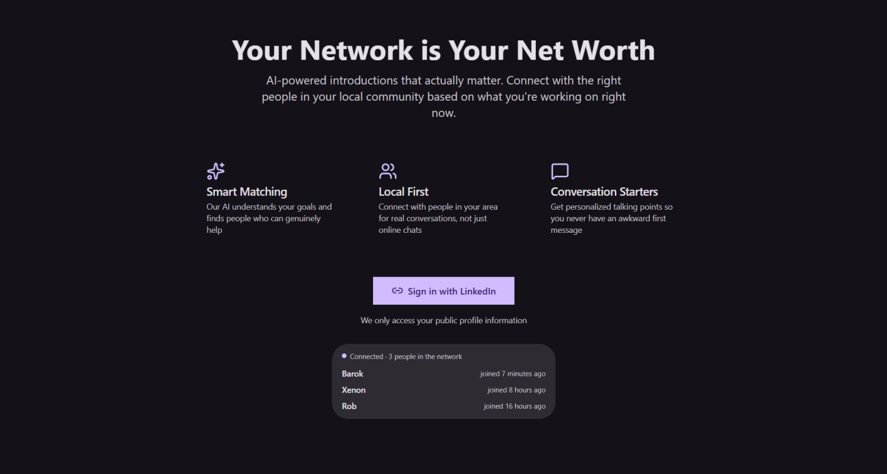
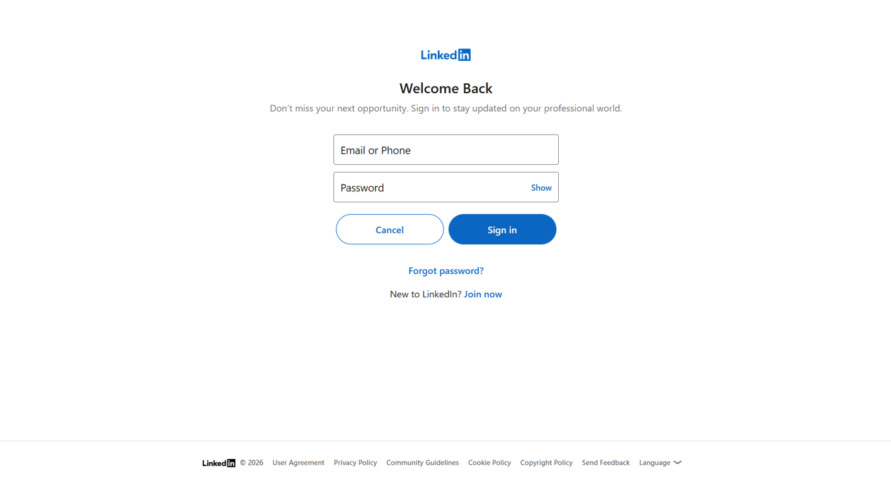
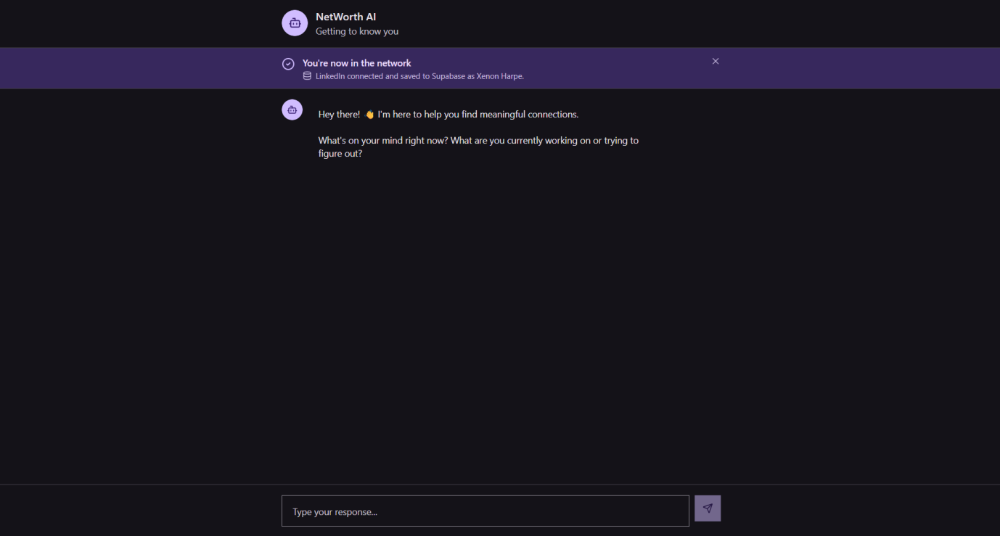
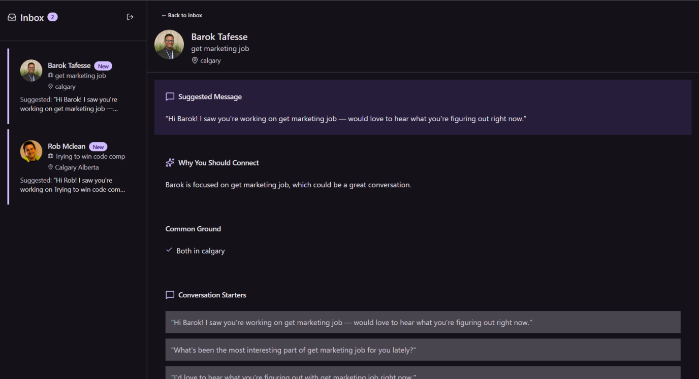

# NetWorth AI

> Your network is your net worth. AI-powered introductions that actually matter.

**Live Demo:** [cursor-hackathon-2026.vercel.app](https://cursor-hackathon-2026.vercel.app)

---

## Screenshots

| Landing Page | OAuth Flow |
|:---:|:---:|
|  |  |

| Onboarding Chat | Match Inbox |
|:---:|:---:|
|  |  |

| Match Detail with AI Rationale |
|:---:|
|  |

---

## Why I Built This

I've sent hundreds of cold LinkedIn messages. Response rate? **2%**. But when a mutual connection introduced me? **80% reply rate**.

The problem isn't that I don't have a network — it's that I have no idea who in my network could actually help with what I'm working on *right now*. LinkedIn shows me connections, not *relevant* connections.

**NetWorth AI solves this** by understanding what you're currently focused on, then finding people who can genuinely help — and giving you the exact words to start the conversation.

---

## What Makes This Different

This is **NOT** another:
- ChatGPT wrapper
- LangChain + Pinecone CRUD app  
- Boilerplate chatbot with a theme

**What's actually novel:**

| Feature | Why It Matters |
|---------|---------------|
| **Dynamic Intent Capture** | Your needs change weekly. Static LinkedIn profiles don't. We ask "What's on your mind?" and match based on your *current* focus. |
| **Bidirectional Matching** | Both parties get matched with tailored rationales. Not a one-way recommendation engine. |
| **AI-Generated Conversation Coaching** | Every match includes *why* you should connect, common ground, and word-for-word openers. No more awkward "Hey, saw your profile..." |
| **Local-First Networking** | Prioritizes geographic proximity for IRL coffee chats, not just "followers" |

---

## The Solution

NetWorth AI is an intelligent networking broker that:

1. **Understands what you're working on** — Conversational onboarding captures your current goals, not just your job title
2. **Authenticates via LinkedIn** — One-click OAuth, no manual profile entry
3. **Finds meaningful matches** — Semantic vector search identifies people who can genuinely help
4. **Brokers the introduction** — AI-generated rationales explain *why* to connect, plus conversation starters

---

## Architecture

```
┌─────────────────┐     ┌─────────────────┐     ┌─────────────────┐
│  React + Vite   │────▶│  Vercel Edge    │────▶│    Inngest      │
│  (Tailwind/MD3) │     │  /api/inngest   │     │  Background Jobs│
└─────────────────┘     └─────────────────┘     └─────────────────┘
        │                                               │
        ▼                                               ▼
┌─────────────────────────────────────────────────────────────────┐
│                     Supabase                                     │
│  ┌─────────────┐  ┌─────────────┐  ┌─────────────┐              │
│  │    Auth     │  │  Postgres   │  │  Realtime   │              │
│  │  (LinkedIn) │  │  + pgvector │  │             │              │
│  └─────────────┘  └─────────────┘  └─────────────┘              │
└─────────────────────────────────────────────────────────────────┘
                            │
                            ▼
                    ┌─────────────┐
                    │   OpenAI    │
                    │ Embeddings  │
                    │   + GPT-4o  │
                    └─────────────┘
```

**Data Flow:**
1. User signs in with LinkedIn OAuth → Supabase Auth creates session
2. Onboarding chat captures intent → Stored in `profiles.prompt_responses`
3. Inngest job generates embeddings → OpenAI text-embedding-3-small → Stored in `profiles.embedding`
4. Matching job runs → pgvector cosine similarity finds matches
5. GPT-4o-mini generates personalized rationales → Stored in `match_suggestions`
6. Supabase Realtime pushes new matches to inbox instantly

---

## Tech Stack

| Layer | Technology | Why |
|-------|------------|-----|
| **Frontend** | React 18, TypeScript (strict), Vite | Modern, fast, type-safe |
| **Styling** | Tailwind CSS, shadcn/ui (Radix) | Material Design 3 aesthetic |
| **Auth** | Supabase Auth + LinkedIn OAuth | Enterprise-grade, zero backend |
| **Database** | PostgreSQL + pgvector | Vector similarity search at scale |
| **Background Jobs** | Inngest | Durable, retryable, observable |
| **AI** | OpenAI (embeddings + GPT-4o-mini) | Best-in-class for semantic understanding |
| **Deployment** | Vercel | Instant deploys, edge functions |

---

## Key Features

### 1. Conversational Onboarding
Chat-based interface asks "What's on your mind?" — capturing *intent*, not just demographics.

### 2. Semantic Matching
User embeddings compared via cosine similarity in pgvector. Matches above threshold are surfaced with AI-generated explanations.

### 3. AI Rationales
Every match includes:
- **Why connect** — Personalized explanation
- **Common ground** — Shared interests/skills
- **Conversation starters** — Word-for-word openers
- **Networking tips** — Advice for making it valuable

### 4. Real-time Updates
Supabase Realtime pushes new matches to your inbox instantly — no refresh needed.

---

## Getting Started

### Prerequisites
- Node.js 18+
- Supabase project (with pgvector enabled)
- OpenAI API key
- Inngest account

### Quick Start

```bash
# Clone and install
git clone <repo-url>
cd cursor-hackathon-2026
npm install

# Configure environment
cp .env.example .env
# Edit .env with your keys

# Run database schema
# In Supabase SQL Editor, run: supabase/schema.sql

# Start development
npm run dev
```

---

## Project Structure

```
├── api/
│   ├── inngest.ts          # Background job handlers
│   └── send-event.ts       # Event dispatch endpoint
├── src/
│   ├── components/ui/      # shadcn/ui components (MD3 themed)
│   ├── hooks/              # useAuth, useMatchSuggestions
│   ├── pages/              # Landing, Onboarding, Inbox
│   └── types/              # TypeScript types
├── supabase/
│   └── schema.sql          # Full database schema
└── screenshots/            # App screenshots for judging
```

---

## What I Learned

- **pgvector is powerful** — Vector similarity search in Postgres is surprisingly fast and eliminates the need for a separate vector DB
- **Inngest simplifies async** — Durable background jobs with automatic retries made the embedding/matching pipeline reliable
- **Intent > Profile** — Asking "What's on your mind?" surfaces better matches than static profile data ever could

---

## License

MIT
